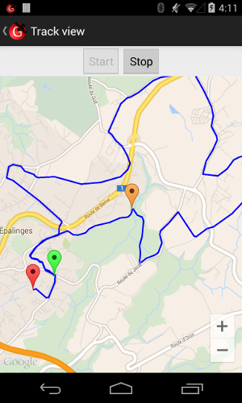

GPSPlayer
=========

This is an Android app that allows you to fake your phone location by making
it follow the path of a GPX file.

This require that you allow "Mock locations" on your phone.

Available on the [play store](https://play.google.com/store/apps/details?id=heigvd.iict.gpsplayer)

Screenshot
----------

Copyright
---------
Written by Julien Rebetez

Copyright 2014 [IICT](http://iict.heig-vd.ch) / [HEIG-VD](http://www.heig-vd.ch)
